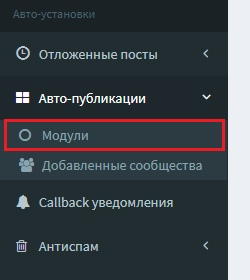
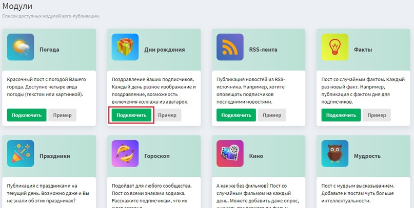

# Авто-публикации


Видеоинструкция


## Что такое авто-публикации?

Это специальные готовые модули (посты) для социальной сети ВКонтакте. С помощью этих модулей можно запланировать готовые тематические посты для своих сообществ ВКонтакте.

Доступные модули:

* _Погода_ - Красочный пост с погодой вашего города. Доступно четыре вида погоды на сегодня и завтра, текущий день, на следующий день, прогноз на изображении).
* _Дни рождения_ - Поздравление ваших подписчиков. Каждый день разное изображение и поздравление, возможность указание своих настроек.
* _RSS-лента_ - Публикация новостей из RSS-источника. Например, хотите оповещать подписчиков последними новостями.
* _Факты_ - Пост со случайным фактом. Каждый раз новый факт. Например, публикация с фактом дня для подписчиков.
* _Праздники_ - Публикация с праздниками на текущий день. Возможно даже и вы не знали об этих праздниках.
* _Гороскоп_ - Подойдет для любого сообщества. Пост со всеми знаками зодиака. Расскажите подписчикам, что их ждет сегодня.
* _Кино_ - Пост со случайным фильмом на каждый день. Можете добавить даже опрос, и узнать понравился ли фильм.
* _Мудрость_ - Пост с мудрым высказыванием. Добавьте к постам чуть больше интеллектуальности.
* _Вопросы_ - Создайте пост с опросом для ваших подписчиков. Создадим для вас случайный интересный опрос.
* _Мемы_ - Создадим вам пост со случайным мемом.
* _Приметы_ - Расскажем вашим пользователям случайную примету.
* _Статистика_ - Создайте пост с нашими тегами и расскажите о статистике за сутки.
* _Рандомное фото с альбома_ - Создайте пост со случайными картинками из альбома (до 10 вложений).
* _Json_ - Позволяет создать любой автопост через Json. Данный модуль для тех, кто разбирается в API.

## Как подключить?

Чтобы подключить перейдите на сайте в раздел **Авто-публикации** далее в раздел **Модули**.

Выберите модуль из доступных и нажмите **Подключить**

После этого Вас перекинет на страницу добавления сообщества для этого модуля.

Настройте на свое усмотрение и нажмите на кнопку **Добавить задание**.

.png>)
