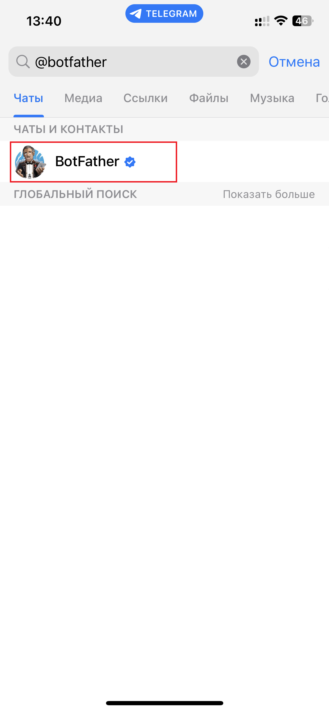
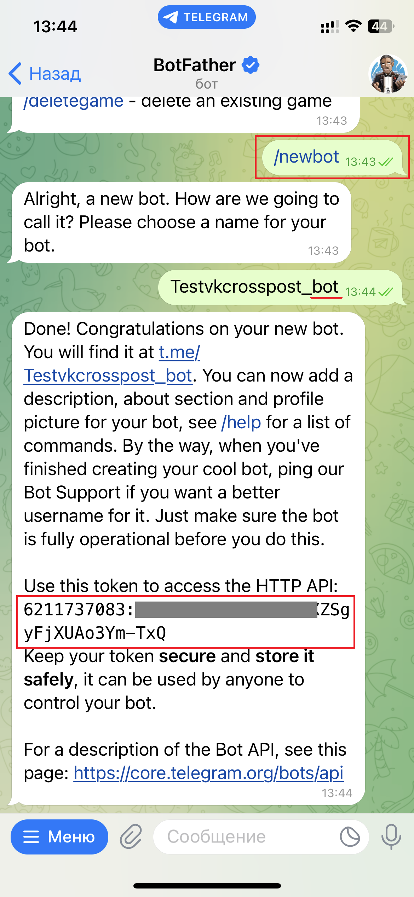
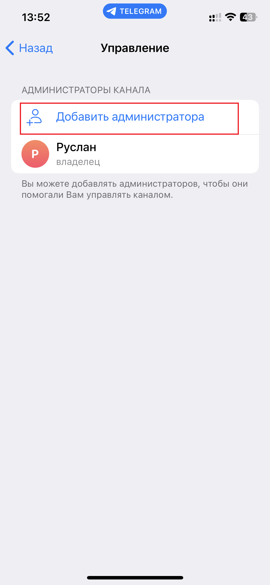
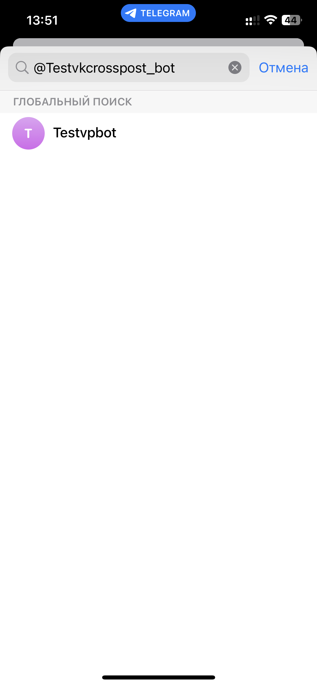
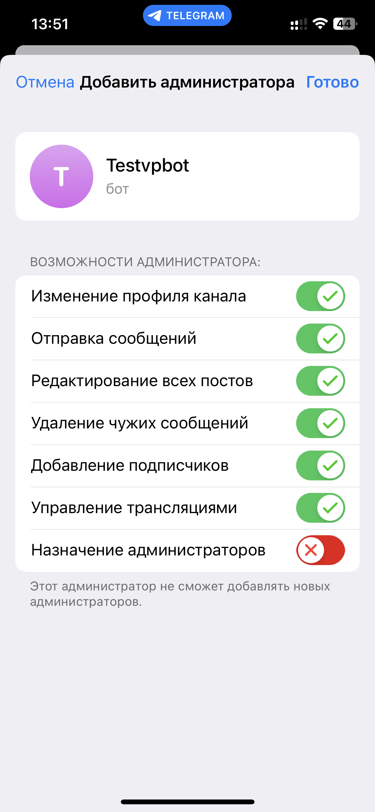
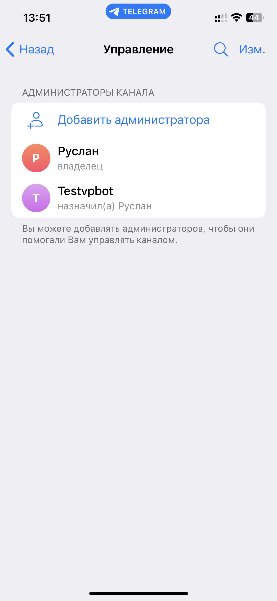

# Подключение Telegram

## Как подключить публичный канал?

### Создайте бота

Откройте приложение Telegram. Найдите бота с ником **@botfather** и напишите ему сообщение **/newbot**

<figure><figcaption>
Поиск бота в Telegram
</figcaption></figure>

**@botfather** спросит название и имя вашего бота. Имя должно заканчиваться на **bot** или **Bot**.

<figure><figcaption>
Создание нового бота и получение токена бота
</figcaption></figure>

**@botfather** пришлет токен вашего бота. Его необходимо скопировать и вставить в поле **Токен бота** на сервисе.

### Добавьте бота в администраторы канала

Добавьте только что созданного бота в администраторы вашего канала.

<figure><figcaption>
Добавление нового администратора
</figcaption></figure>

<figure><figcaption>
Поиск бота для добавления в администраторы
</figcaption></figure>

<figure><figcaption>
Разрешение прав боту
</figcaption></figure>

<figure><figcaption>
Добавленный бот в администраторы
</figcaption></figure>

### Подключение канала

Скопируйте ссылку на ваш канал и вставьте в поле **Ссылка на канал**.

Пример как можно указывать:

* https://t.me/vposteru
* @vposterru

## Как подключить публичную группу?

Чтобы подключить публичную группу укажите постоянную ссылку и вставьте её в поле **Ссылка на канал** на сервисе.

## Как подключить частный канал?

> Идентификатор недоступен для обычного пользователя – в адресной строке вы не увидите цифровых обозначений. Но их можно получить, используя дополнительные инструменты. В этом могут помочь боты.

Чтобы подключить частный канал нужно узнать **id** канала:

1. Пригласите своего созданного бота (которого вы создали в боте **BotFather**) и добавьте в администраторы канала.
2. Находим бота **@myidbot** (IDBot).
3. Теперь пересылаем из частного канала какую-нибудь публикацию боту **@myidbot**. Это может быть абсолютно что угодно.
4. Бот **IDBot** ответит вам, переслав идентификатор «**ID of channel**» будут нужные цифры (Id канала с минусом). Да, он начинается с минуса. Не удивляйтесь, для каналов это совершенно нормально.
5. Скопировать **id** (все что после **ID of channel:** со знаком минусом).
6. Вставить этот **id** в поле **Ссылка на канал** на сервисе.

### Как подключить частную группу?

> Идентификатор недоступен для обычного пользователя – в адресной строке вы не увидите цифровых обозначений. Но их можно получить, используя дополнительные инструменты. В этом могут помочь боты.

Чтобы подключить частную группу инужно узнать **id** группы:

1. Пригласите своего созданного бота (которого вы создали в боте **BotFather**) и добавьте в администраторы канала.
2. Находим бота **@myidbot** (IDBot).
3. Приглашаем бота **@myidbot** (IDBot) в нашу частную группу.
4. Теперь отправляем в нашу группу сообщение **/getgroupid** и получаем ответ от бота.
5. Бот **IDBot** ответит вам, переслав идентификатор вашей группы «**Your supergroup ID is**». Да, он начинается с минуса. Не удивляйтесь, для групп это совершенно нормально.
6. Скопировать все, что идет после **Your supergroup ID is:** (с минусом)
7. Вставить этот **id** в поле **Ссылка на канал** на сервисе.

### Как подключить кросспостинг в тему?

Для подключения кросспостинга в тему нужно указать **ссылку-приглашение** в поле **Ссылка на канал** в настройках кросспостинга.

<figure><figcaption>
Получение ссылки темы
</figcaption></figure>

<figure><figcaption>
Формат ссылки темы для кросспостинга
</figcaption></figure>

### Как подключить кросспостинг в тему частной группы?

Темы из частной группы пока нельзя подключить, но в будущем добавим эту возможность.
