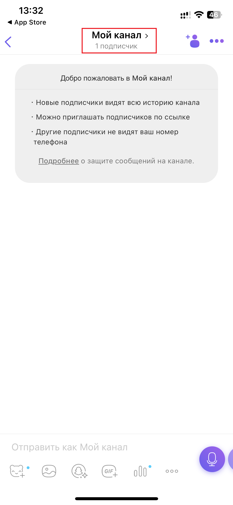
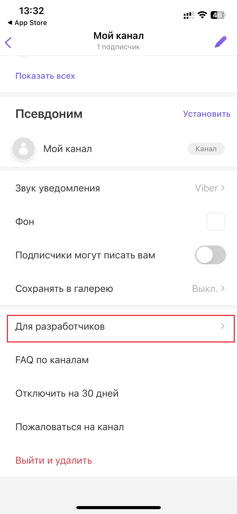
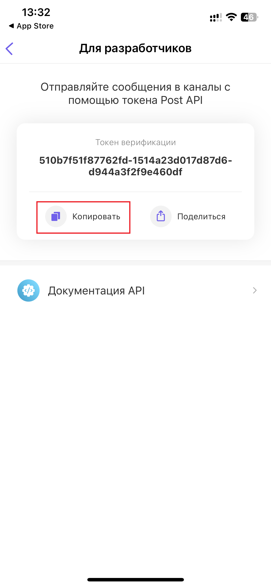

# Подключение Viber

## Как подключить канал?

Для получения ключа верификации откройте канал и нажмите на его заголовок

<figure><figcaption></figcaption></figure>

Прокрутите вниз и выберите «**Для разработчиков**»

<figure><figcaption></figcaption></figure>

Вот **токен верификации**, скопируйте его и вставьте в кросспостинге в поле «**Токен верификации**»

<figure><figcaption></figcaption></figure>

## Как подключить группу или сообщество?

Подключать можно только каналы. Viber не позволяет публиковать в группы или сообщества.
