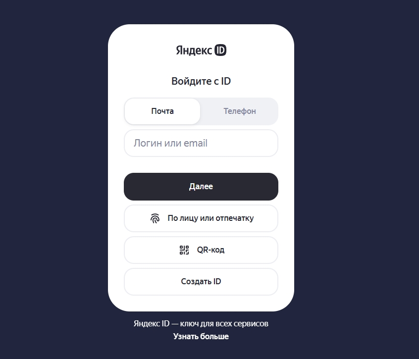

# Автоматическая маркировка рекламы через Впостер

Впостер автоматически будет передавать данные в ОРД (оператор рекламных данных) и маркировать рекламные посты или истории. Сервис возьмет всю отчетность в свои руки, включая создание контрагентов, договоров, креативов, площадок, актов и разаллокаций к ним.

**Доступные ОРД на данный момент**:

* [VK ОРД](https://ord.vk.com/)
* [ОРД Яндекс](https://ord.yandex.ru/)


Сервис умеет маркировать рекламу на площадках: **ВКонтакте**, **Одноклассники, Telegram, Rutube и мессенджере Max**.



Видеоинструкция


## Как Впостер маркирует рекламу?

Сервис автоматически отправляет все ваши данные в ОРД и создает:

* Нового контрагента (рекламодателя), если его там нет. Также заполняет ваши данные контрагента (издателя), если вы их не указали.
* Создает договор с контрагентом (с рекламодателем).
* Создает креатив на основе данных рекламного поста. Сервис передаст текст поста и все вложения.
* Добавит площадку, если она там не добавлена.
* В конце каждого месяца (**каждое 7 число месяца**) сервис создает акты по договорам и делает разаллокации по всем вашим креативам за текущий период. Либо же подает статистику в ОРД, если акты были уже сформированы.
* Автоматически маркирует рекламные посты/истории в соцсетях.
* Автоматически удаляет рекламные посты, если вы не настроили авто-удаление поста. Это нужно для того, чтобы не отчитываться перед ЕРИР каждый месяц за эти рекламные публикации.


Вообщем, сервис будет делать всю сложную юридическую работу по вашим рекламным публикациям, тем самым соблюдая [закон № 38-ФЗ](https://www.consultant.ru/document/cons_doc_LAW_389115/).


## Инструкция по маркировке через сервис Впостер

### Как подключить VK ОРД?

1. Авторизуемся на сайте [VK ОРД](https://ord.vk.com/) через VK ID или любой другой способ.

<figure><figcaption></figcaption></figure>

2. В верхнем меню выбираем раздел [Ключи доступа к API](https://ord.vk.com/keys).

<figure><figcaption></figcaption></figure>

3. Вводим название ключа `vposter.ru` и нажимаем на кнопку **Сгенерировать**. Далее копируем данный ключ и сохраняем. Нам нужно будет вставить его на сервисе.

<figure><figcaption></figcaption></figure>

### Как подключить ОРД Яндекс?

1. Авторизуемся на сайте [ord.yandex.ru](https://ord.yandex.ru/) через Яндекс ID.

<figure><figcaption></figcaption></figure>

2. После авторизации, если вы не регистрировали свой кабинет, то ОРД Яндекс попросить зарегистрировать и верифицировать свой кабинет. Вам потребуется ввести свои данные и загрузить документы для подтверждения.

<figure><figcaption></figcaption></figure>

3. После перехода в сам кабинет откройте раздел "Настройки" и нажмите в правом вверхнем углу на кнопку "Открыть доступ к API".

<figure><figcaption></figcaption></figure>

4. Поставьте галочку возле "Доступ к API" и сохраните изменения.

<figure><figcaption></figcaption></figure>

5. После сохранения изменений у вас появится сверху кнопка "Получить токен для API". Вам нужно нажать на эту кнопку и получить токен для Впостера.

### Куда вводить ключ на Впостере?

1. Авторизуемся на сервисе [vposter.ru](https://vposter.ru/posts/ord) и открываем раздел **Отложенные посты**. В этом разделе переходим в подраздел **Настройки ОРД**.

<figure><figcaption>
Меню на сервисе Впостер
</figcaption></figure>

2. Выбираем ОРД и заполняем здесь свои данные: ИНН, ФИО, тип организации, номер телефона ключ API, выбираем роли и сохраняем настройки подключения. Больше здесь мы ничего менять не будем. Эти данные мы заполняем **один раз и навсегда**. В любой момент вы можете переключать на другой ОРД и использовать его для маркировки.

<figure><figcaption>
Настройки подключение к ОРД на Впостере
</figcaption></figure>

## Как маркировать пост?

После того, как заполнили свои данные, нажимаем **Создать пост** и начинаем планировать пост, как обычно. Тут главное включить режим **Маркировать рекламу** и заполнить данные рекламодателя: ФИО рекламодателя, ИНН рекламодателя, сумму поста и вид организации. Если это юридическое лицо или ИП, то просто вставьте ИНН, и наименование лица само прогрузится. В дальнейшем все ваши рекламодатели будут сохранены, и при клике на поле ИНН подгрузится выпадающий список с вашими рекламодателями для быстрого выбора.

После того, как вы заполнили данные рекламодателя в посте, можете публиковать пост сразу, либо ставить на таймер.

<figure><figcaption>
Настройки маркировки поста через сервис Впостер
</figcaption></figure>

Теперь, при создании рекламного поста, нам всегда нужно будет только включить режим **Маркировать рекламу** и заполнить данные рекламодателя: ФИО, ИНН, сумму и тип организации.


Посты доступны только для ВКонтакте, Одноклассников, Telegram, Rutube и Max.


## Как маркировать репост?

Для маркировки репоста нажимаем **Создать пост** и включаем режим **Сделать репост.** Указываем тут ссылку на пост, который вы хотите репостнуть и далее заполняем настройки маркировки.


Репосты доступны только для ВКонтакте и Одноклассников.


<figure><figcaption>
Создание репоста через сервис Впостер
</figcaption></figure>

## Как маркировать историю?

Для маркировки истории ВКонтакте нажимаем **Создать историю.** Загружаем изображение или видео для истории потом включаем режим **Маркировать рекламу.** Указываем здесь данные рекламодателя и нажимаем **Создать**.


Истории доступны только для ВКонтакте и Одноклассников.


<figure><figcaption>
Создание истории через Впостер
</figcaption></figure>

## Пример маркированного поста во ВКонтакте через Впостер

Сервис автоматически промаркировал пост и добавил специальный заголовок для соблюдения [закона № 38-ФЗ](https://www.consultant.ru/document/cons_doc_LAW_389115/).

<figure><figcaption>
Маркировка поста во ВКонтакте
</figcaption></figure>

## Пример маркированного репоста во ВКонтакте через Впостер

Сервис автоматически промаркировал репост и добавил специальный заголовок для соблюдения [закона № 38-ФЗ](https://www.consultant.ru/document/cons_doc_LAW_389115/). У репостов нельзя добавить маркировку в меню поста, поэтому мы добавляем в комментарий к репосту.

<figure><figcaption>
Маркировка репоста во ВКонтакте
</figcaption></figure>

## Пример маркированной истории во ВКонтакте через Впостер

Сервис автоматически промаркировал историю и добавил специальный заголовок для соблюдения [закона № 38-ФЗ](https://www.consultant.ru/document/cons_doc_LAW_389115/).

<figure><figcaption>
Маркировка истории во ВКонтакте
</figcaption></figure>

## Пример маркированного поста в Telegram через Впостер

Сервис автоматически промаркировал пост и добавил специальный заголовок "О Рекламодателе", где содержится ссылка с информацией рекламодателя на сайте VK ОРД для соблюдения [закона № 38-ФЗ](https://www.consultant.ru/document/cons_doc_LAW_389115/).

<figure><figcaption>
Маркировка поста в Telegram
</figcaption></figure>

## Пример маркированного поста в Max через Впостер

Сервис автоматически промаркировал пост и добавил специальный заголовок "О Рекламодателе", где содержится ссылка с информацией рекламодателя на сайте VK ОРД для соблюдения [закона № 38-ФЗ](https://www.consultant.ru/document/cons_doc_LAW_389115/).

<figure><figcaption>
Маркировка поста в Max
</figcaption></figure>

## Пример маркированного поста в Одноклассниках через Впостер

Сервис автоматически промаркировал пост и добавил специальный заголовок для соблюдения [закона № 38-ФЗ](https://www.consultant.ru/document/cons_doc_LAW_389115/).

<figure><figcaption>
Маркировка поста в Одноклассниках
</figcaption></figure>

## Как маркировать рекламу в других соцсетях?

Мы умеем маркировать рекламу только в VK, Одноклассниках, Telegram, Rutube и мессенджере Max. В других социальных сетях маркировать нужно самостоятельно через ОРД.

### Таблица отчетности по маркировке рекламы

В таблицу отчетности заносятся все ваши опубликованные посты/репосты/истории. На основе этой таблицы сервис формирует и сдает отчетность. В таблице вы можете просмотреть всю историю по маркировке рекламы с вашего кабинета.

<figure><figcaption>
Кнопка для открытия таблицы отчетности
</figcaption></figure>

## Ответы на вопросы

Что такое маркировка рекламы?

Маркировка рекламы включает в себя:

* отметку «реклама» на креативе, а также информацию о рекламодателе
* токен — код из букв и цифр, который позволяет определить оператора рекламных данных, который сгенерировал токен для креатива, а также рекламодателя
* отчетность по итогам кампании в ЕРИР

По правилам отметка о рекламе и токен должны быть на самом рекламном объявлении — в начале текста или на фото и видео, если текста нет. С помощью сервиса Впостер вы можете получить токен и отметку о рекламе автоматически. Идентификатор нативно отображается в публикациях, не отвлекая пользователей от контента.

Для чего нужно маркировать рекламу? Что будет, если этого не делать?

Маркировать рекламу нужно, чтобы соблюдать закон. Требования прописаны в ст. 18.1 закона «О рекламе». Если нарушить закон, можно получить штраф, который составляет от 10 до 500 тысяч рублей.

Как добавить маркировку?

1. На сервисе выберите подраздел «Настройки ОРД VK».
2. Заполните ключ API от ОРД VK и свои личные данные.
3. После сохранения настроек можете планировать пост по кнопке "Создать пост".
4. Готово: теперь при каждом создании поста включайте параметр "Маркировать рекламу" и заполняйте данные рекламодателя. Сервис автоматически отправит все эти данные В ОРД и отчитается по ним.

Что считается рекламой и требует маркировки?

**Реклама** — это информация, которая помогает привлекать внимание к объекту рекламирования, продвигать его, поддерживать к нему интерес.

**Объектом рекламирования** может быть продукт или услуга, продавец или изготовитель, результаты интеллектуального труда, а ещё мероприятие: концерт, конкурс, фестиваль или спортивный матч.

Подробнее о том, что считается рекламой, можно изучить тексте Федерального закона «[О рекламе](https://base.garant.ru/12145525/)».

К рекламе можно отнести практически любую информацию, которая помогает привлекать внимание к бренду, продуктам и услугам или мероприятиям.

Под маркировку подпадают все основные форматы интернет-рекламы в рунете: например, разные варианты баннеров, реклама в видео, клипах, промопосты в соцсетях и многое другое. Но маркировать каждый материал не придётся.

В каких случаях маркировка не требуется?

Маркировка не требуется, если информация не является рекламой. Несколько примеров, где не нужно добавлять маркировку:

* если вы пишете о собственных товарах или мероприятиях в своём профиле или сообществе, тем самым вы информируете пользователей о ваших продуктах и услугах
* материалы, которые содержат информацию о подписке на собственные издания и способах её оформления
* анонсы собственных мероприятий, в том числе те, которые СМИ освещает в рамках информационного партнёрства

Но здесь есть уточнения — если в материалах слишком явно выделяется товар или услуга, их могут признать рекламой.

Если вы из личных побуждений рекомендуете книгу, фильм, мероприятие или даже продукт, которым пользуетесь, — по умолчанию это не реклама, маркировать ничего не нужно. Но обратите внимание: если в рекомендации содержится сильная эмоциональная окраска или есть призыв купить товар или посетить мероприятие, то такую рекомендацию контролирующие органы могут признать рекламой.

Нужно ли маркировать публикации, которые вышли до 1 сентября 2023 года?

Да, нужно. Поправки в закон «О рекламе», согласно которым вся реклама в рунете должна маркироваться, вступили в силу с 1 сентября 2022 года. Согласно им, маркировка должна быть у всей рекламе в рунете — в том числе если она была опубликована до 1 сентября 2022 года.

Нужно ли маркировать бартерные публикации?

Да, их также необходимо маркировать.

Если я постоянно работаю с одним и тем же контрагентом, нужно ли мне заново заполнять информацию о нём?

Достаточно один раз добавить информацию о контрагенте, и она сохранится в сервисе. Когда вы в следующий раз будете работать с контрагентом, то можете просто выбрать его из списка.

Какие документы нужны, чтобы получить токен?

Чтобы получить токен, понадобятся:

* ИНН компании или человека, который размещает рекламу;
* ИНН рекламодателя;
* договор с рекламодателем с указанием типа, даты, номера и предмета услуг.

Также могут понадобиться другие документы и информация — конкретный список зависит от того, рекламируете ли вы собственный проект или размещаете материалы от рекламодателя, а также от того, делаете ли вы это напрямую или через агентство.

Кто несёт ответственность за нарушение?

Ответственность за наличие отметки «реклама» и сведений о рекламодателе лежит на стороне того, кто размещает рекламу.

Что делать, если у меня нет договора с заказчиком?

По требованиям законодательства РФ, у вас должен быть заключен договор с рекламодателем. Публикация рекламы без оформления договора является нарушением. Поэтому перед размещением рекламной публикации и получением токена обязательно оформите договор с вашим рекламодателем.

Что делать, если я не знаю всех данных договора?

Самый проверенный вариант — запросить у рекламодателя. При этом стоит отметить, что по законодательству РФ у вас должен быть заключен договор с рекламодателем, а один экземпляр должен быть у вас на руках.

Я не знаю ИНН рекламодателя, где его взять?

Возможно несколько способов. Можно запросить у рекламодателя напрямую, посмотреть в договоре, который вы заключили или попробовать найти организацию в [реестре ЕГРИЛ/ЕРЮЛ](https://egrul.nalog.ru/index.html).

Что делать, если я не знаю всех данных о Заказчике

Самый проверенный вариант — запросить у него напрямую или посмотреть в договоре. Данных требуется совсем немного: наименование компании/ФИО и ИНН.

Какой НДС указывать самозанятым?

У самозанятых нет НДС. Поэтому самозанятым нужно указывать **Без НДС**.

Нужно ли оформлять каждый месяц новый договор?

**Да!**

Сервис формирует акт по договору только один раз — в месяце, следующем за отчетным. Поэтому, если выход постов распределен на несколько месяцев, рекомендуем заключать новый договор каждый месяц.\
\
**Почему лучше оформлять договор ежемесячно?**\
Если использовать один договор на несколько месяцев, в акте будет отражена разаллокация (распределение бюджетов) только по тем креативам, которые выходили в первый месяц действия договора. По остальным креативам в ОРД ВК будет передана только статистика без привязки к акту.\
\
Если же заключать новый договор каждый месяц, то в ежемесячном акте будет корректно отображаться разаллокация по всем креативам, вышедшим в этом месяце.

**Пример для понимания**\
\
<mark style="color:$info;">Представьте ситуацию:</mark>\ <mark style="color:$info;">У вас есть рекламная кампания, которая выходит в период с 15 марта по 15 апреля.</mark>\
 <mark style="color:$info;">— В марте вышло 3 поста</mark>\
 <mark style="color:$info;">— В апреле вышло 2 поста</mark>\
\
 <mark style="color:$info;">**⨯ Плохой вариант — один договор на два месяца**</mark>\
 <mark style="color:$info;">• Вы заключаете один договор в марте и размещаете все 5 постов по нему</mark>\
 <mark style="color:$info;">• 7 апреля сервис создаёт акт за март — в нём будет разаллокация только по 3 мартовским постам</mark>\
 <mark style="color:$info;">• В мае сервис должен сформировать акт за апрель, но договор уже «закрыт» актом за март, поэтому новый акт не формируется</mark>\
 <mark style="color:$info;">• В результате:</mark>\ <mark style="color:$info;">— в акте за апрель вы не увидите ничего</mark>\ <mark style="color:$info;">— статистика по 2 апрельским постам уйдёт в ОРД ВК 7 мая, но без отдельного акта</mark>\
 <mark style="color:$info;">• Итог: у вас один акт (только на март) и «потерянные» в документах апрельские креативы</mark>\
\
 <mark style="color:$info;">✔</mark> <mark style="color:$info;"></mark><mark style="color:$info;">**Хороший вариант — новый договор каждый месяц**</mark>\
 <mark style="color:$info;">• В марте вы заключаете договор №1, в апреле — договор №2</mark>\
 <mark style="color:$info;">• 7 апреля сервис формирует акт по договору №1 — в нём разаллокация по всем 3 мартовским постам</mark>\
 <mark style="color:$info;">• 7 мая сервис создаёт акт по договору №2 — в нём разаллокация по 2 апрельским постам</mark>\
 <mark style="color:$info;">• Итог: у вас два акта (март + апрель), и в каждом — только те креативы, которые вышли в соответствующем месяце</mark>\
<mark style="color:$info;">• Всё прозрачно, чисто и корректно с документами</mark>

Через какие ОРД можно маркировать рекламу на Впостере?

Можно использовать **VK ОРД** или **ОРД Яндекс**. Другие ОРД в данный момент у нас не поддерживаются.


[krossposting-iz-vk](../krossposting-iz-vk/)


