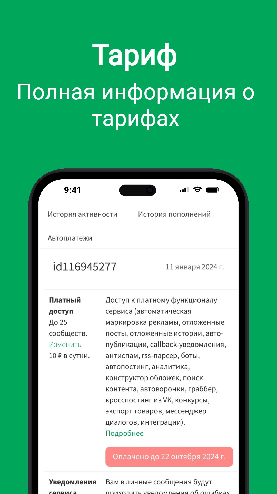
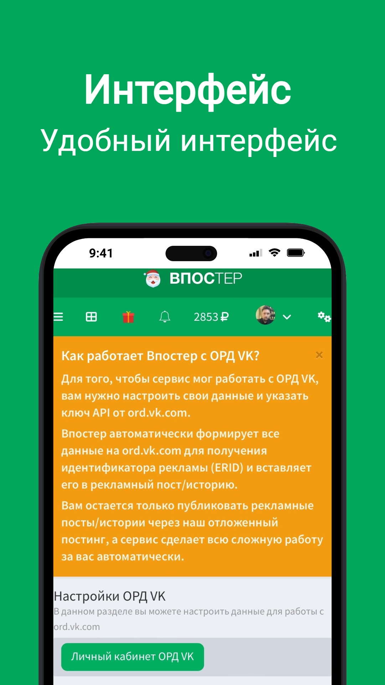
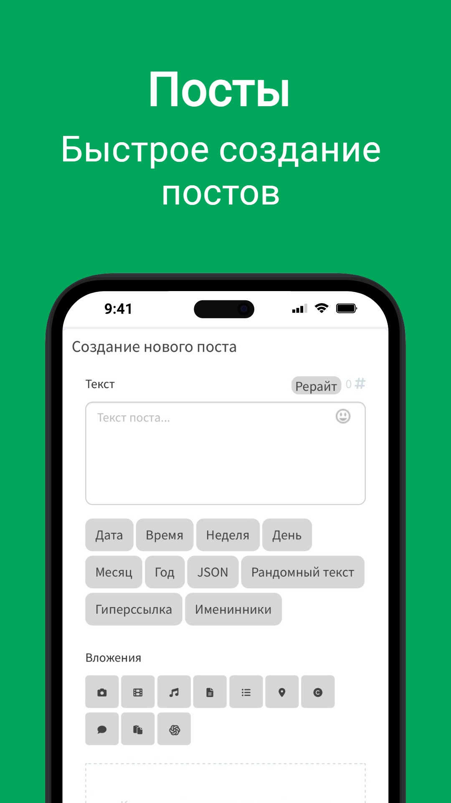

# Приложение Android / iPhone

Сервис адаптирован для [PWA (Прогрессивное веб-приложение)](https://ru.wikipedia.org/wiki/%D0%9F%D1%80%D0%BE%D0%B3%D1%80%D0%B5%D1%81%D1%81%D0%B8%D0%B2%D0%BD%D0%BE%D0%B5_%D0%B2%D0%B5%D0%B1-%D0%BF%D1%80%D0%B8%D0%BB%D0%BE%D0%B6%D0%B5%D0%BD%D0%B8%D0%B5) и поэтому его удобно использовать на различных мобильных устройствах.

<figure><figcaption></figcaption></figure>

## **Возможности:**

* Быстрый доступ к сервису через смартфон.
* Все инструменты сервиса, но намного быстрее.
* Высокая скорость открытия страниц с помощью кеширования.
* Дополнительные возможности для смартфонов.
* Не занимает много места в смартфоне.

## Скриншоты

<figure><figcaption></figcaption></figure> <figure><figcaption></figcaption></figure> <figure><figcaption></figcaption></figure> <figure><figcaption></figcaption></figure> <figure><figcaption></figcaption></figure> <figure><figcaption></figcaption></figure> <figure><figcaption></figcaption></figure>

Установить приложение можно по ссылке: [vposter.ru/app](https://vposter.ru/app)
